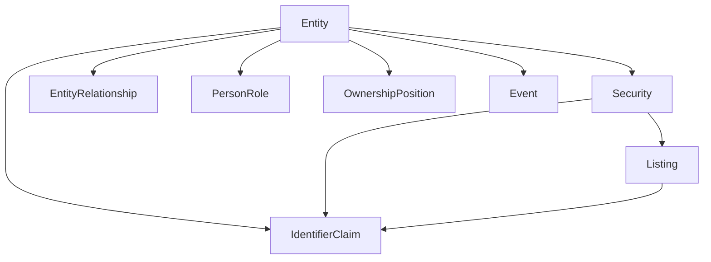

# Domain Models

The domain layer contains the core data models for EntitySpine - pure Python
dataclasses with zero external dependencies.

## Overview

## Core Models

| Model | Description | Key Fields |
|-------|-------------|------------|
| [Entity](entity.md) | Legal identity (company, person, fund) | `entity_id`, `primary_name`, `entity_type` |
| [Security](security.md) | Financial instrument | `security_id`, `security_type`, `entity_id` |
| [Listing](listing.md) | Exchange-specific ticker | `listing_id`, `ticker`, `mic` |
| [IdentifierClaim](claim.md) | Identifier assertion with provenance | `scheme`, `value`, `namespace` |

## Knowledge Graph Models

| Model | Description | Key Fields |
|-------|-------------|------------|
| [Event](event.md) | Business events (M&A, earnings, dividends) | `event_type`, `title`, `fiscal_period` |
| [EntityRelationship](../graph/relationship.md) | Entity-to-entity edges | `source_entity_id`, `target_entity_id`, `relationship_type` |
| [PersonRole](../graph/person-role.md) | Person-to-org roles | `person_entity_id`, `org_entity_id`, `role_type` |
| [OwnershipPosition](../graph/ownership.md) | Ownership holdings | `holder_entity_id`, `issuer_entity_id`, `shares_held` |

## Enums

All enums are string-based for JSON serialization:

::: entityspine.domain.enums.EntityType

::: entityspine.domain.enums.IdentifierScheme

::: entityspine.domain.enums.EventType

See [Enums Reference](enums.md) for the complete list.
